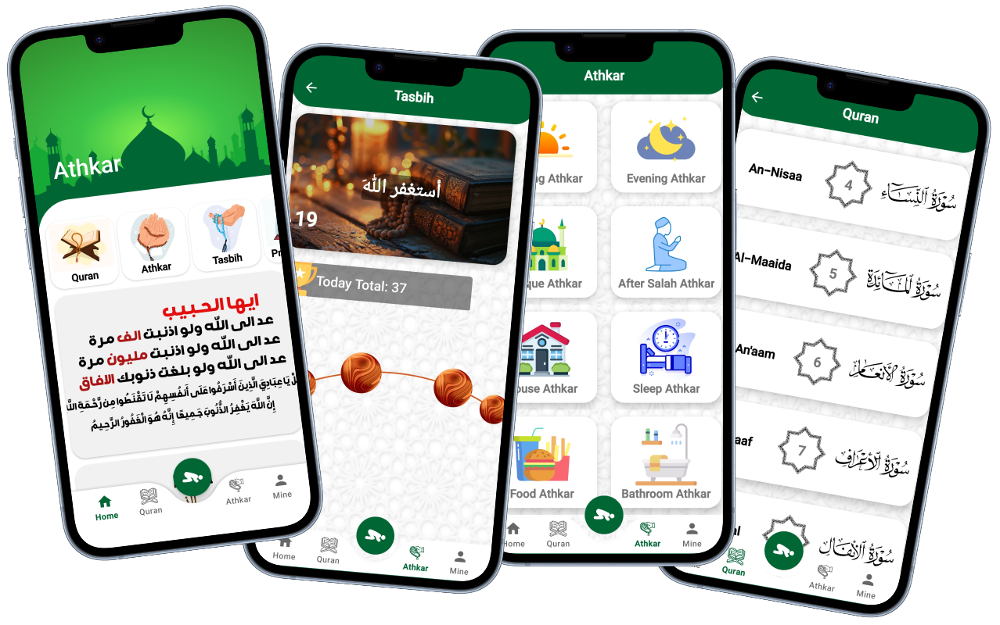

# Athkar App 🤲

  

---

## Overview

Athkar App is a user-friendly mobile application designed to help Muslims effortlessly access and engage with daily supplications (Athkar), read and listen to the Holy Quran, and perform Tasbih with ease. The app offers a clean interface and essential features that support your spiritual routine.

---

## Features

### Home Screen
- Quick access to main sections with an important daily reminder.

### Quran
- Browse and select Surahs.
- Read clear Arabic text.
- Listen to high-quality audio recitations.

### Athkar
- Organized collections of supplications for various occasions, such as Morning, Evening, Mosque, After Salah, and more.
- Each Athkar includes Arabic text and a repetition counter.

### Tasbih Counter
- Digital counter with engaging animations on tap.
- Tracks your daily progress and overall achievements.

---

## User Experience
- Modern green-and-white color scheme for a calming feel.
- Intuitive bottom navigation bar for easy switching between Home, Quran, Athkar, and Profile.
- Clear Arabic typography for comfortable reading.

---

## Coming Soon

Exciting features in development to enhance your spiritual journey:

- Notifications reminding you to read morning and evening Athkar.
- Prayer time alerts.
- A dedicated achievements page to monitor your Quran reading and Athkar progress daily.

---

## Screenshots

Check the app screenshots above!  
(Add more images here if needed.)

---
